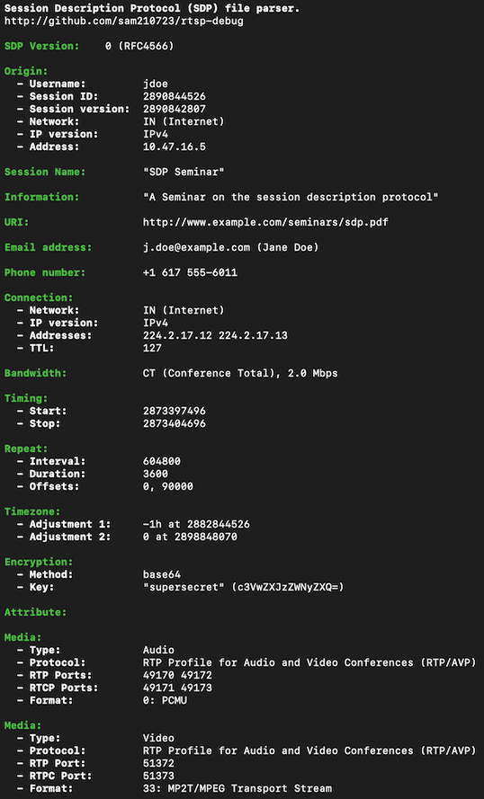

# rtsp-debug
Tool for working with the RTSP protocol and RTP streams.

Test patterns are from https://www.w6rz.net.

## sdp.py

Session Description Protocol (SDP) file parser. Based on [RFC4566](https://tools.ietf.org/html/rfc4566) and [RFC3551](https://tools.ietf.org/html/rfc3551). Requires [colorama](https://pypi.org/project/colorama/).

```
usage: sdp.py [-h] path

Session Description Protocol (SDP) file parser.

positional arguments:
  path        SDP file path

optional arguments:
  -h, --help  show this help message and exit
```